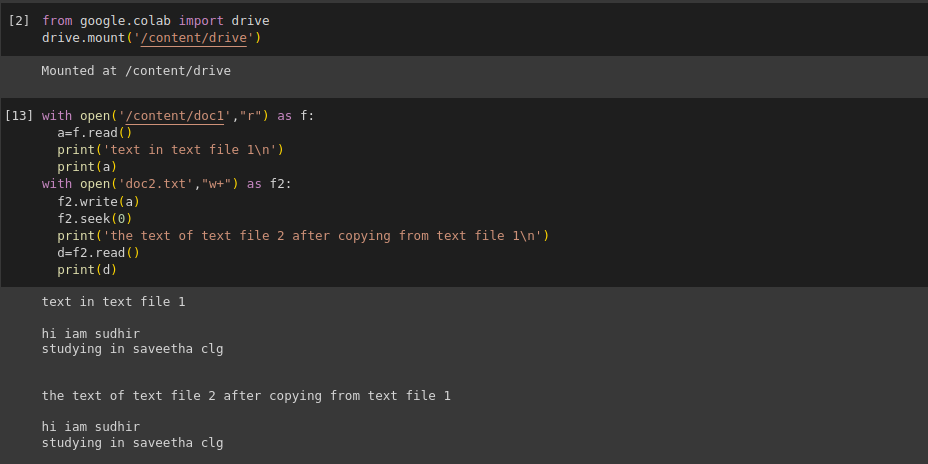

# copy-file
## AIM:
To write a python program for copying the contents from one file to another file.
## EQUIPEMENT'S REQUIRED: 
PC
Anaconda - Python 3.7
## ALGORITHM: 
### Step 1:
mount the drive

### Step 2: 
 open the text file 1 
### Step 3: 
read the text file 1
### Step 4:  
open text file 2 
### Step 5: 
write the text of text file 1 in text file 2 using read() and write()
### Step 6: 
end the program
## PROGRAM:
```python
from google.colab import drive
drive.mount('/content/drive')

with open('/content/doc1',"r") as f:
  a=f.read()
  print('text in text file 1\n')
  print(a)
with open('doc2.txt',"w+") as f2:
  f2.write(a)
  f2.seek(0)
  print('the text of text file 2 after copying from text file 1\n')
  d=f2.read()
  print(d)
```

### OUTPUT:


## RESULT:
Thus the program is written to copy the contents from one file to another file.